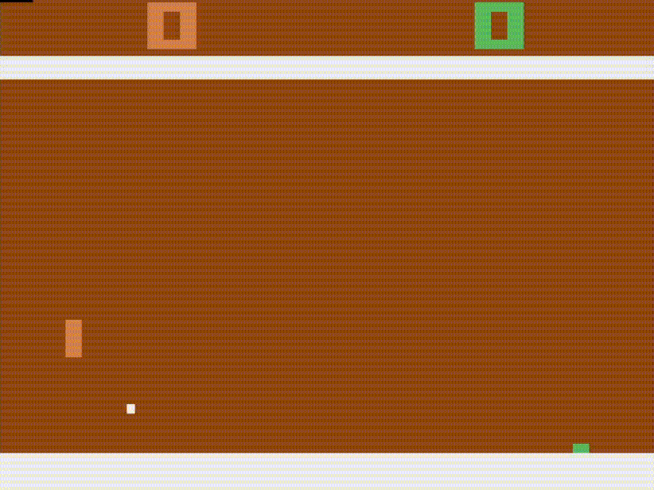
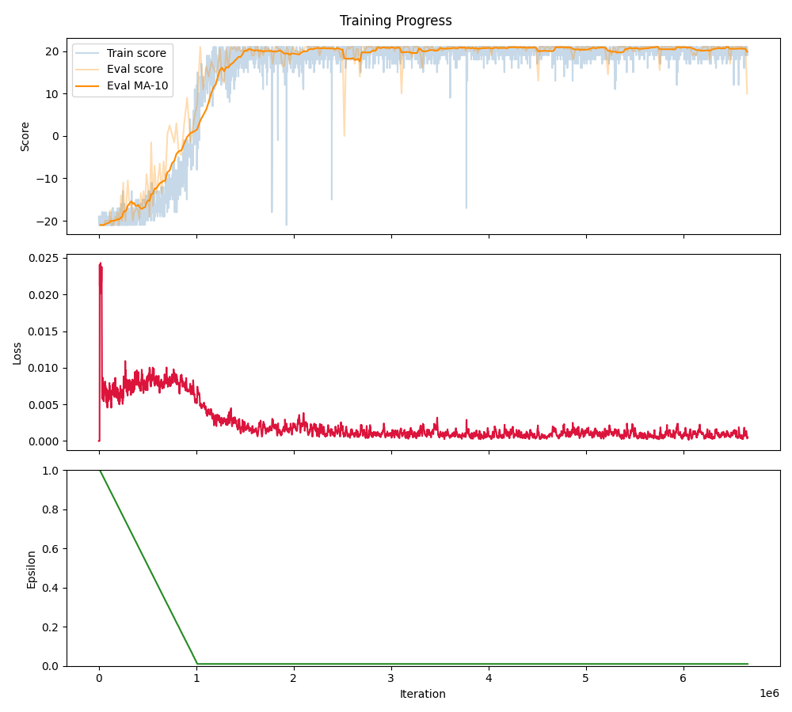
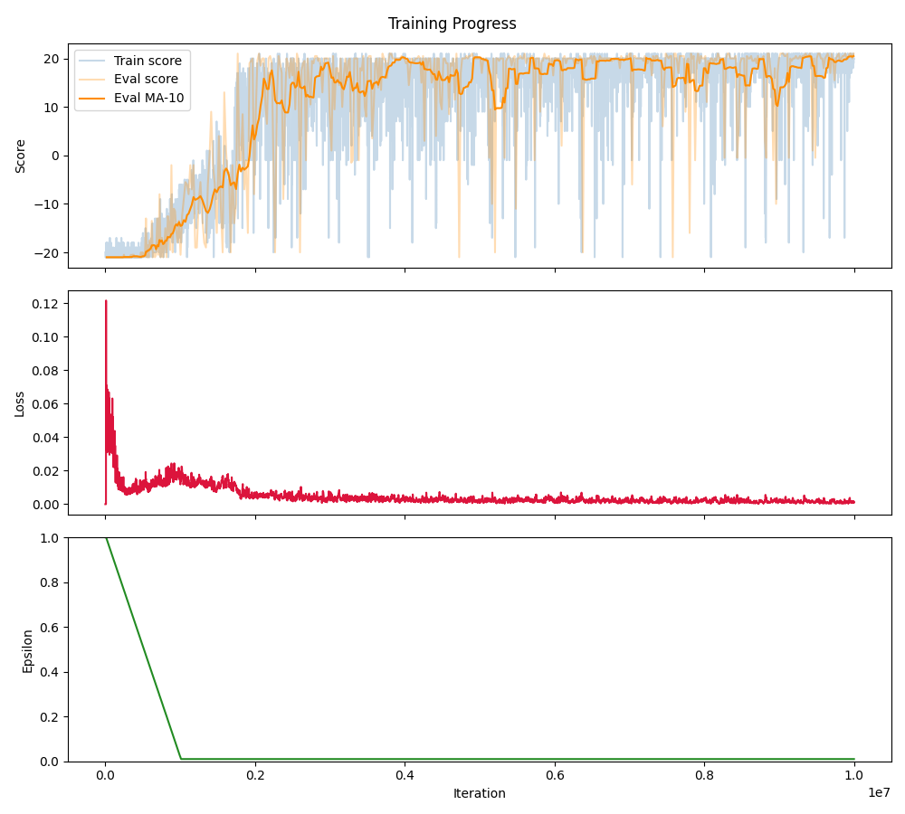
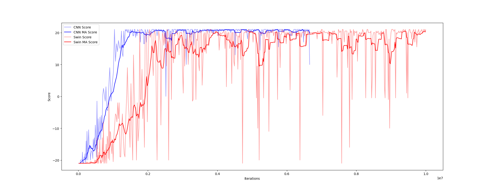
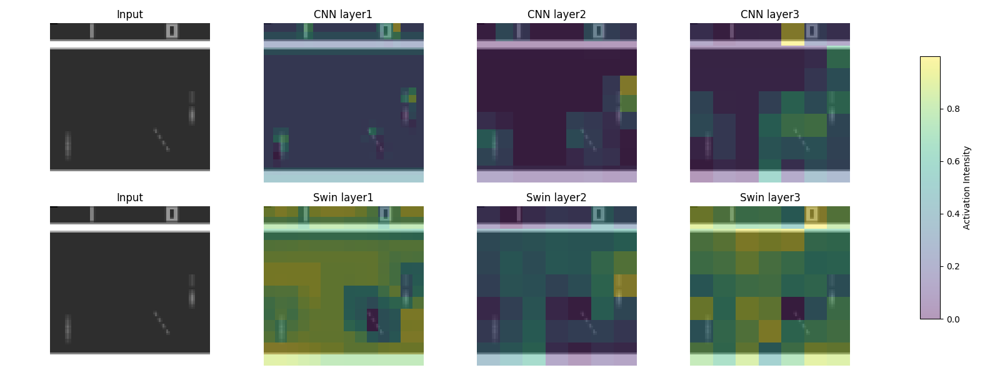
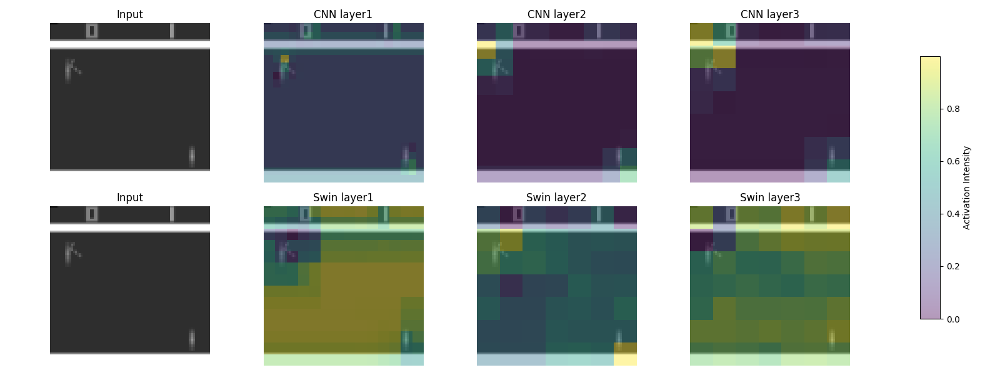
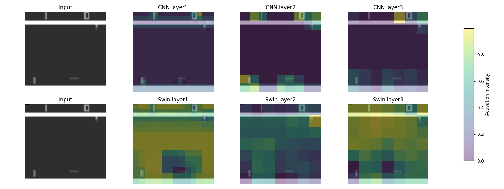

# Advanced AI

## Pong Agent
tryna get this thang to learn pong

### After having learned Pong:
#### CNN (right)


#### Swin (right)


#### CNN (left) vs Swin (right)


### Setup Instructions

- Create a Python or conda virtual environment:
```
python -m venv venv
```
or 
```
conda create venv 
```
- Activate that venv:
##### macOS / Linux (venv)
```
source venv/bin/activate
```
##### Windows (venv - CMD/PowerShell)
```
.\venv\Scripts\activate
```
##### Conda environment
```
conda activate venv
```
- Install the dependencies from `requirements.txt`:
```
pip install -r requirements.txt
```
- After that's done, try and run training:
```
python main.py --name CNN_Model --model CNN
```
The argument `name` will create model and plot files under that given name. The argument `model` will determine whether the trained model uses the CNN or Swin architecture. The choices are `CNN` and `Swin`, the default is `CNN`.

This won't stop until it reaches `1,000,000` iterations, which will take a while, but you can just cancel it with `Ctrl-C` and this will save your model `.pth` file into a `results` folder.

If you want to see how your model is performing with the human eye run the `play.py` script with the path to the `.pth` file:
```
python play.py path/to/model.pth
```


## PettingZoo - If you want the models to play against each other.
Disclaimer, this is particularly difficult to get working and can be quite slow, especially at the beginning. It took numerous attempts for us to get it working ourselves and would not work on a windows laptop entirely. Probably not worth trying but if you are interested in getting it to work. 

- [PettingZoo](https://pettingzoo.farama.org/) - An API Standard for multi-agent reinforcement learning

- Within the same virtual environment as before, first clone this repository and install its contents using
```
git clone --depth=1 https://github.com/Farama-Foundation/Multi-Agent-ALE.git
cd ./Multi-Agent-ALE
python3 setup.py install
cd .. # to return to project directory
```
- After this is complete, install the `battle_requirements.txt` packages
```
pip install -r battle_requirements.txt
```
### Human vs Swin/CNN Model

To play against one of these models yourself, run the following:
- Against Swin:
```
python3 human_vs_model.py models/battle_models/right_Swin.pth
```
- Against CNN:
```
python3 human_vs_model.py models/battle_models/left_CNN.pth
```
The controls are `A` for UP, `D` for DOWN and `SPACE` for FIRE (this is required to serve when its your turn)
### Watch models compete or play against them yourself!

- To watch the Swin vs CNN battle (while they train!), run
```
python battle.py models/battle_models/right_Swin.pth models/battle_models/left_CNN.pth --render
```
or if you want to watch the training from scratch, run
```
python battle.py <right_model> <left_model> --render
```
This will allow two models to train against each other, the pre-trained models have been provided and are in the 'models' folder. The battle models have been trained, and are designed specifically for this purpose, to help you visualize a decent match against each other. However, if you wish to visualize the training from scratch, the orginal models can also be loaded in if you swap out the arguments. 

The render will allow you to visualize them playing against each other, if it is not included then the training will be done but no viewing. 

### Current Results

The figures below show the moving eval score averages with window size 10, along with the scores for each episode, the training loss and the epsilon value.

The eval score is calculated by following a greedy policy on the current Q-model.

### CNN


### Swin Transformer


### Comparison


### Activation Maps





## Ideas and Reading

---

### Potential papers:
- Playing Atari with Deep Reinforcement Learning, https://huggingface.co/papers/1312.5602
 
### RL resources:
- David Silver RL lectures, https://www.youtube.com/playlist?list=PLqYmG7hTraZDM-OYHWgPebj2MfCFzFObQ
- RL project ideas, https://www.projectpro.io/article/reinforcement-learning-projects-ideas-for-beginners-with-code/521
- RLCard, https://rlcard.org/
- RLCard git, https://github.com/datamllab/rlcard

- [Reinforcement Learning Tutorial with Demo](https://github.com/omerbsezer/Reinforcement_learning_tutorial_with_demo)

#### [tmlr](https://github.com/trackmania-rl/tmrl) - "a fully-fledged distributed RL framework for robotics, designed to help you train Deep Reinforcement Learning AIs in real-time applications"
- This is a pretty cool framework which was originally made for playing Trackmania. He has some nice videos demonstrating it being put to use.
- While Trackmania would be a cool game for us to work on, I think it could be a little out of our depth.
- Still, there are some instructions for using this framework on other games.

#### https://github.com/Farama-Foundation/stable-retro - "A fork of gym-retro ('lets you turn classic video games into Gymnasium environments for reinforcement learning') with additional games, emulators and supported platforms."
- Seems pretty interesting and useful for establishing games on the reinforcement learning side of things
- Could choose a semi-difficult, interesting one from here. 

#### https://github.com/amjadmajid/deep-reinforcement-learning-games-from-scratch - Deep Reinforcement Learning: Building Games from Scratch
- This one is quite cool but the games are very basic (snake, gridsearch etc)
- However, was all built without the use of gymnasium's library
- Could provide a better underlying understanding of reinforcement learning and make for a better project. 

---
#### **Idea**: Use ViT for RL:
- [Transformers in Reinforcement Learning: A Survey](https://arxiv.org/pdf/2307.05979)
- [On Transforming Reinforcement Learning With Transformers: The Development Trajectory](https://ieeexplore.ieee.org/abstract/document/10546317)
- [stable-retro](https://github.com/Farama-Foundation/stable-retro)
- [Deep Reinforcement Learning with SWIN Transformers](https://dl.acm.org/doi/10.1145/3653876.3653899)
- [Medium Article using ViT to play Pong](https://pub.aimind.so/playing-pong-with-vision-transformer-dd8818b2ccba)

- [Improving Sample Efficiency of Value Based Models Using Attention and Vision Transformers](https://arxiv.org/abs/2202.00710)
    - This is similar to the Swin Transformer paper, but uses the ViT instead. Perhaps we should take inspiration from their architecture.
### Note on forward hooks for generating activation maps
https://www.geeksforgeeks.org/deep-learning/what-are-pytorch-hooks-and-how-are-they-applied-in-neural-network-layers/ 
---

We are thinking of using the [Arcade Learning Environment with Tetris](https://ale.farama.org/environments/tetris/)
