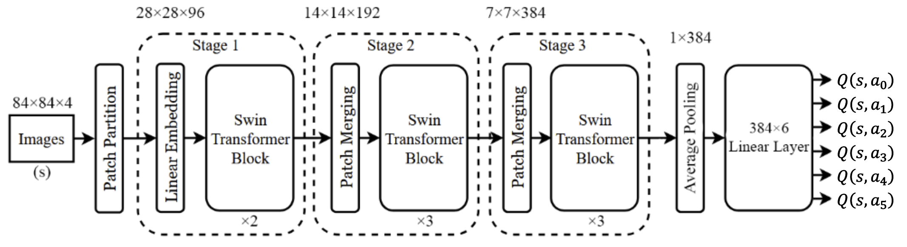
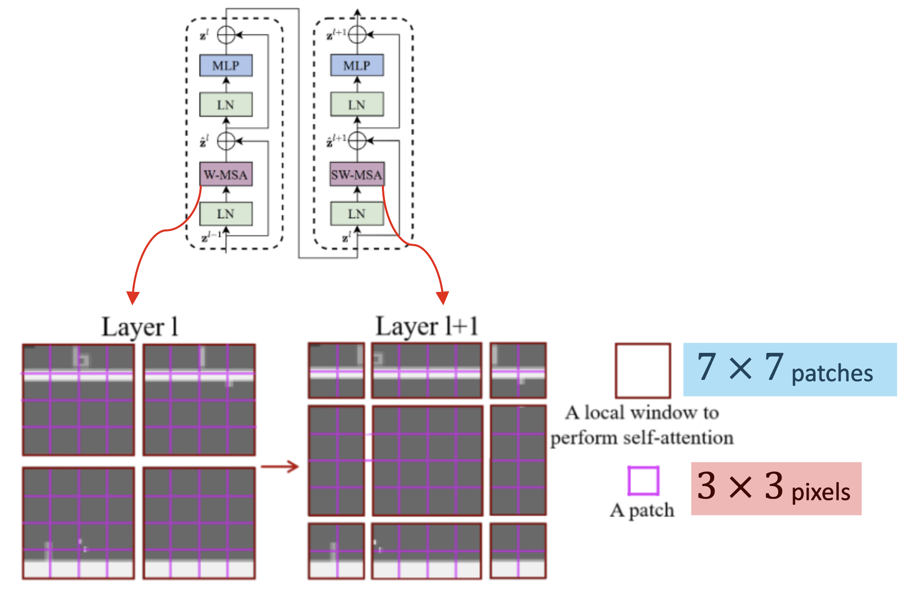

# Swin DQN for Pong

In this project we trained two DQN RL agents: one using a Swin transformer as a backbone and the other using a CNN as a backbone (the same as the one used in the original DQN paper). We compare their policies by putting each one up against the Pong bot. Using PettingZoo, we put the two models up against each other to determine once and for all which is better.




### After having learned Pong:
<table>
  <tr>
    <td align="center">
      <strong>CNN (right)</strong><br>
      
    </td>
    <td align="center">
      <strong>Swin (right)</strong><br>
      
    </td>
    <td align="center">
      <strong>CNN (left) vs Swin (right)</strong><br>
      
    </td>
  </tr>
</table>

### Setup Instructions

- Create a virtual environment:
```
python -m venv venv
source venv/bin/activate
```
- Install the dependencies from `requirements.txt`:
```
pip install -r requirements.txt
```
- After that's done, try and run training:
```
python main.py --name CNN_Model --model CNN
```
The argument `name` will create model and plot files under that given name. The argument `model` will determine whether the trained model uses the CNN or Swin architecture. The choices are `CNN` and `Swin`, the default is `CNN`.

This won't stop until it reaches `1,000,000` iterations, which will take a while, but you can just cancel it with `Ctrl-C` and this will save your model `.pth` file into a `results` folder.

If you want to see how your model is performing with the human eye run the `play.py` script with the path to the `.pth` file:
```
python play.py path/to/model.pth
```

## [PettingZoo](https://pettingzoo.farama.org/) - If you want the models to play against each other.

- Within the same virtual environment, clone this repository and install its contents using
```
git clone --depth=1 https://github.com/Farama-Foundation/Multi-Agent-ALE.git
cd ./Multi-Agent-ALE
python3 setup.py install
cd .. # to return to project directory
```
- After this is complete, install the `battle_requirements.txt` packages
```
pip install -r battle_requirements.txt
```
### Human vs Swin/CNN Model
To play against one of these models yourself, run the following:
- Against Swin:
```
python3 human_vs_model.py models/battle_models/right_Swin.pth
```
- Against CNN:
```
python3 human_vs_model.py models/battle_models/left_CNN.pth
```
The controls are `A` for UP, `D` for DOWN and `SPACE` for FIRE (this is required to serve when its your turn)
### Watch models compete!
- To watch the Swin vs CNN battle (while they train!), run
```
python battle.py models/battle_models/right_Swin.pth models/battle_models/left_CNN.pth --render
```
or if you want to watch the training from scratch, run
```
python battle.py <right_model> <left_model> --render
```
This will allow two models to train against each other, the pre-trained models have been provided and are in the 'models' folder. The battle models have been trained, and are designed specifically for this purpose, to help you visualize a decent match against each other. However, if you wish to visualize the training from scratch, the orginal models can also be loaded in if you swap out the arguments. 

The render will allow you to visualize them playing against each other, if it is not included then the training will be done but no viewing. 

### Training Results

The figures below show the moving eval score averages with window size 10, along with the scores for each episode, the training loss and the epsilon value.

The eval score is calculated by following a greedy policy on the current Q-model.

### CNN


### Swin Transformer


### Comparison


### Activation Maps


