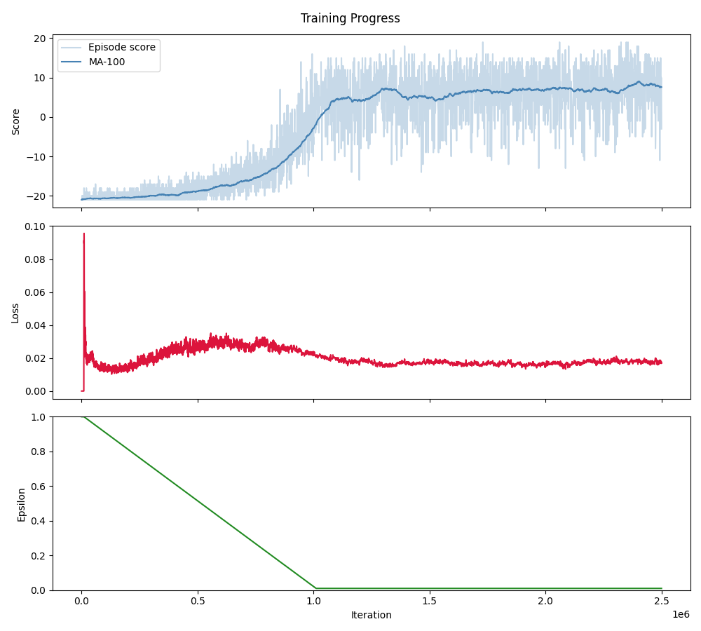
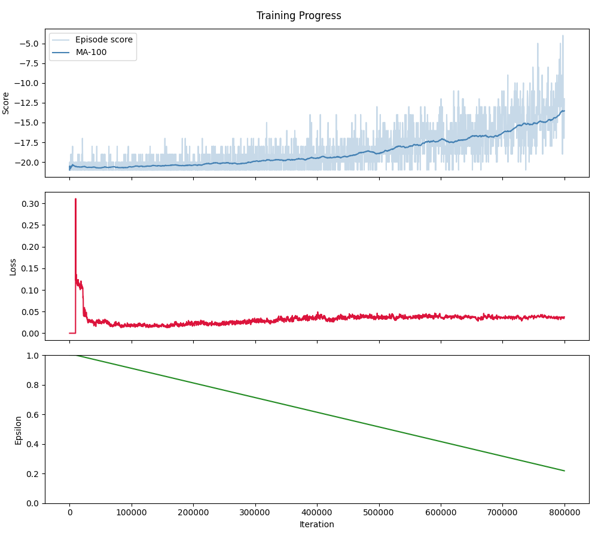

# Advanced AI

## Pong Agent
tryna get this thang to learn pong

---

Try this to run it:

- Create a Python venv:
```
python -m venv venv
```
- Activate that venv (you might have to do it differently if you're on Windows):
```
source venv/bin/activate
```
- Install the dependencies from `requirements.txt`:
```
pip install -r requirements.txt
```
- After that's done, try and run it:
```
python main.py
```

This won't stop until it reaches `1,000,000` iterations, which will take a while, but you can just cancel it with `Ctrl-C` and this will save your model `.pth` file into a `results` folder.

If you want to see how your model is performing with the human eye run the `play.py` script with the path to the `.pth` file:
```
python play.py path/to/model.pth
```

### Current Results

These are our results as of 16/03/26. The figures below show the moving average with window size 100 of the episode scores, along with the scores for each episode, the training loss and the epsilon value.

These were both trained for the same period of time, demonstrating how the Swin model takes significantly longer to train.

### CNN


### Swin Transformer


## Ideas and Reading

---

### Potential papers:
- Playing Atari with Deep Reinforcement Learning, https://huggingface.co/papers/1312.5602
 
### RL resources:
- David Silver RL lectures, https://www.youtube.com/playlist?list=PLqYmG7hTraZDM-OYHWgPebj2MfCFzFObQ
- RL project ideas, https://www.projectpro.io/article/reinforcement-learning-projects-ideas-for-beginners-with-code/521
- RLCard, https://rlcard.org/
- RLCard git, https://github.com/datamllab/rlcard

- [Reinforcement Learning Tutorial with Demo](https://github.com/omerbsezer/Reinforcement_learning_tutorial_with_demo)

#### [tmlr](https://github.com/trackmania-rl/tmrl) - "a fully-fledged distributed RL framework for robotics, designed to help you train Deep Reinforcement Learning AIs in real-time applications"
- This is a pretty cool framework which was originally made for playing Trackmania. He has some nice videos demonstrating it being put to use.
- While Trackmania would be a cool game for us to work on, I think it could be a little out of our depth.
- Still, there are some instructions for using this framework on other games.

#### https://github.com/Farama-Foundation/stable-retro - "A fork of gym-retro ('lets you turn classic video games into Gymnasium environments for reinforcement learning') with additional games, emulators and supported platforms."
- Seems pretty interesting and useful for establishing games on the reinforcement learning side of things
- Could choose a semi-difficult, interesting one from here. 

#### https://github.com/amjadmajid/deep-reinforcement-learning-games-from-scratch - Deep Reinforcement Learning: Building Games from Scratch
- This one is quite cool but the games are very basic (snake, gridsearch etc)
- However, was all built without the use of gymnasium's library
- Could provide a better underlying understanding of reinforcement learning and make for a better project. 

---
#### **Idea**: Use ViT for RL:
- [Transformers in Reinforcement Learning: A Survey](https://arxiv.org/pdf/2307.05979)
- [On Transforming Reinforcement Learning With Transformers: The Development Trajectory](https://ieeexplore.ieee.org/abstract/document/10546317)
- [stable-retro](https://github.com/Farama-Foundation/stable-retro)
- [Deep Reinforcement Learning with SWIN Transformers](https://dl.acm.org/doi/10.1145/3653876.3653899)
- [Medium Article using ViT to play Pong](https://pub.aimind.so/playing-pong-with-vision-transformer-dd8818b2ccba)

- [Improving Sample Efficiency of Value Based Models Using Attention and Vision Transformers](https://arxiv.org/abs/2202.00710)
    - This is similar to the Swin Transformer paper, but uses the ViT instead. Perhaps we should take inspiration from their architecture.

---

We are thinking of using the [Arcade Learning Environment with Tetris](https://ale.farama.org/environments/tetris/)
